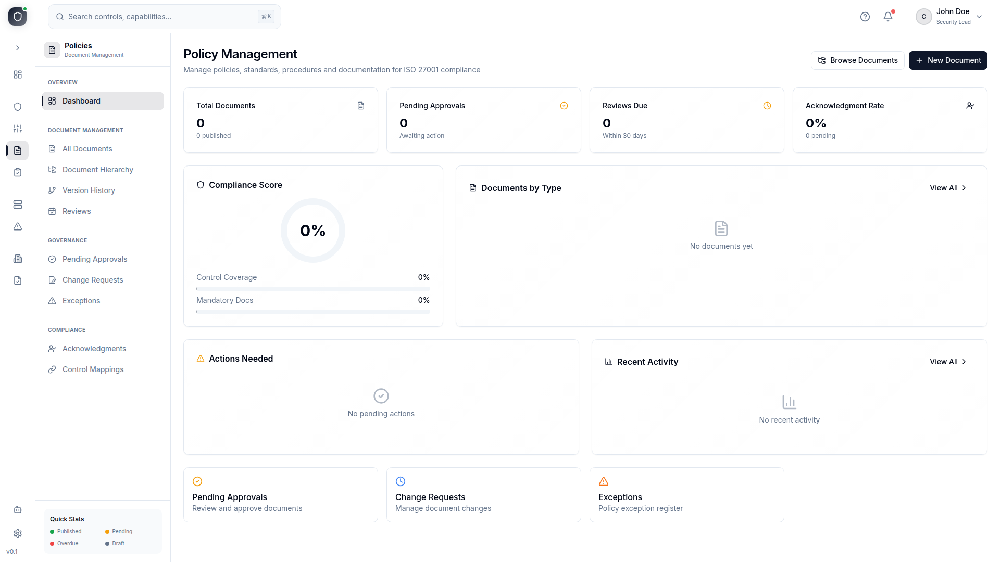

<div align="center">

# RiskReady Community Edition

Open-source GRC platform. 254 AI tools. Human-approved autonomy.

[](LICENSE)
[](https://github.com/riskreadyeu/riskready-community/issues)
[](https://github.com/riskreadyeu/riskready-community/stargazers)


</div>

## Get running

```bash
git clone https://github.com/riskreadyeu/riskready-community.git
cd riskready-community
cp .env.example .env        # edit: POSTGRES_PASSWORD, JWT_SECRET, ADMIN_EMAIL, ADMIN_PASSWORD
docker compose up -d         # first run ~3 minutes
open http://localhost:9380   # log in as ciso@clearstream.ie / password123
```

> Requires Docker 24+ with Compose v2. Linux, macOS, or Windows (WSL2).

---

## What this is

9 MCP servers expose 254 tools that connect Claude directly to your compliance database — risks, controls, policies, incidents, audits, evidence, ITSM, and organisation governance.

Every AI mutation is **proposed, not executed**. A human reviews and approves each action before it touches the database. This holds for interactive chat, scheduled runs, and autonomous workflows.

```
You:    "Give me a full security posture assessment."
Agent:  Convenes AI Council → 6 specialists analyse in parallel → CISO synthesises
        → structured report with consensus, dissents, and prioritised actions
Cost:   $0.19 on Haiku. $10 on Opus. 96% token reduction via tool search.
```

---

## Three ways to connect

| Mode | How it works | AI cost to you | Security |
|------|-------------|:--------------:|:--------:|
| **Web App** | Built-in chat UI with streaming, council, scheduled workflows | You pay per token | 8.1/10 |
| **MCP Proxy** | Claude Desktop connects remotely via API key — one endpoint, all 254 tools | **$0** | **8.9/10** |
| **Direct** | 9 stdio servers on your machine for local development | $0 | 2.3/10 |

The MCP Proxy is the recommended mode for teams. Each user brings their own Claude subscription. You provide the tools and the security layer. [Connection modes compared →](documentation/CONNECTION_MODES.md)

---

## GRC modules

| Module | What it covers |
|--------|---------------|
| **Risk Management** | Risk register, scenarios, KRIs, tolerance statements, treatment plans |
| **Controls** | Control library, assessments, Statement of Applicability, gap analysis |
| **Policies** | Document lifecycle, version control, change requests, reviews, exceptions |
| **Incidents** | Tracking, classification, response workflows, lessons learned |
| **Audits** | Internal audit planning, nonconformity tracking, corrective actions |
| **Evidence** | Collection, file storage, linking to controls, risks, and incidents |
| **ITSM** | IT asset register, change management, capacity planning |
| **Organisation** | Structure, departments, locations, committees, key personnel |

<details>
<summary><strong>Screenshots</strong> (click to expand)</summary>
<br />





</details>

---

## AI Agents Council

Complex questions convene 6 specialist agents:

| Agent | Domain |
|-------|--------|
| Risk Analyst | Risk register, scenarios, KRIs, tolerance, treatments |
| Controls Auditor | Control effectiveness, SOA, assessments, gap analysis |
| Compliance Officer | Policies, frameworks (ISO 27001, DORA, NIS2), governance |
| Incident Commander | Incident patterns, response metrics, lessons learned |
| Evidence Auditor | Evidence coverage, audit readiness, nonconformities |
| CISO Strategist | Cross-domain synthesis — produces the final report |

Each member queries the database independently, then the CISO synthesises. All reasoning is preserved for audit. [Benchmarks →](documentation/AI_COUNCIL_BENCHMARKS.md)

---

## Security

Every AI mutation goes through human approval. No exceptions, no auto-approve, not even for scheduled runs.

The [8-point agent security audit](documentation/AGENT_SECURITY_AUDIT.md) covers:

1. **Identity & Authorization** — per-user API keys with per-tool permission scoping
2. **Memory** — 90-day TTL, injection scanning, org-scoped recall
3. **Tool Trust** — 254 first-party tools, Zod-validated, no third-party MCP servers
4. **Blast Radius** — zero HTTP outbound, rate limiting, scoped API keys
5. **Human Checkpoints** — tiered severity (low/medium/high/critical) on all mutations
6. **Output Validation** — credential scanning, PII redaction, grounding guard
7. **Cost Controls** — token budgets, turn caps, council rate limits
8. **Observability** — tool call logging, behavioral anomaly detection, source tracking

---

## Demo data

First deploy auto-seeds **ClearStream Payments Ltd** — a fictional European fintech regulated under DORA and NIS2: 15 risks, 30 scenarios, 40 controls, 12 policies, 8 incidents, 20 assets, 5 nonconformities, 20 evidence records, and 6 months of trend data.

Log in as `ciso@clearstream.ie` / `password123` for the most complete view.

---

## Documentation

| Guide | |
|-------|-|
| **[AI Platform Guide](documentation/AI_GUIDE.md)** | MCP servers, gateway, council, scheduler, workflows, approval pipeline |
| **[Deployment](documentation/DEPLOYMENT.md)** | Docker setup, env vars, production TLS, troubleshooting |
| **[User Guide](documentation/USER_GUIDE.md)** | Web app walkthrough for all 8 GRC modules |
| **[Connection Modes](documentation/CONNECTION_MODES.md)** | Web App vs MCP Proxy vs Direct — feature comparison |
| **[Agent Security Audit](documentation/AGENT_SECURITY_AUDIT.md)** | 8-point framework with per-mode scoring and code references |
| **[MCP Server Reference](documentation/mcp-servers/)** | All 254 tools with parameters and examples |
| **[API Reference](documentation/API_REFERENCE.md)** | REST endpoints, request/response formats |
| **[Administration](documentation/ADMINISTRATION.md)** | Backup, monitoring, updates, security hardening |

---

## Development

```bash
docker compose up db -d
cd apps/server && npm install && cp .env.example .env
npx prisma db push --schema=prisma/schema && npm run prisma:seed
npm run dev                              # backend :4000
cd ../web && npm install && npm run dev  # frontend :5173
```

---

[Contributing](CONTRIBUTING.md) · [Security](SECURITY.md) · [License: AGPL-3.0](LICENSE)
