<div align="center">

# RiskReady Community Edition

The first open-source GRC platform with an **autonomous AI Agents Council** — 9 MCP servers, 250+ tools, scheduled workflows, and multi-agent deliberation.
<br />
A proactive AI system that runs compliance workflows on schedules, responds to incidents autonomously, and convenes a council of 6 specialist agents for complex cross-domain decisions — all with human-in-the-loop approval.

[](LICENSE)
[](https://github.com/riskreadyeu/riskready-community/issues)
[](https://github.com/riskreadyeu/riskready-community/stargazers)

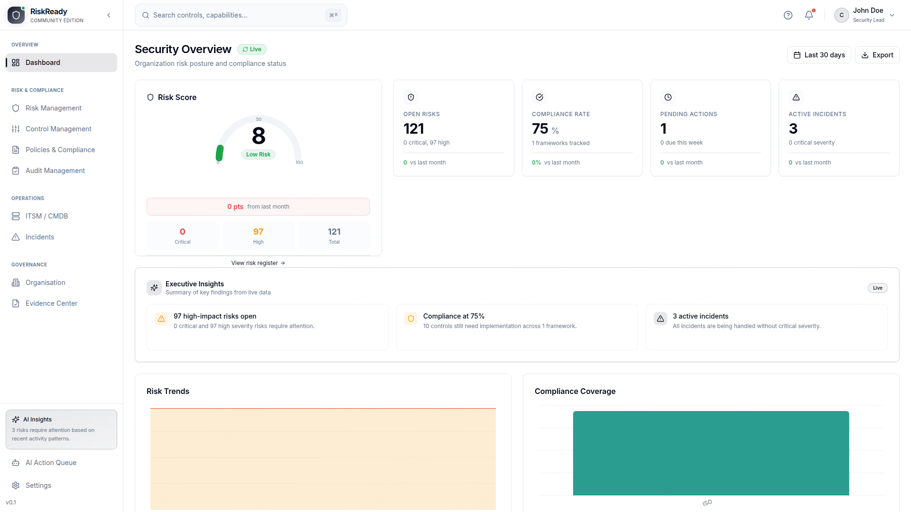

</div>

---

## Table of Contents

- [Why RiskReady](#why-riskready)
- [AI Architecture](#ai-architecture)
- [Agentic AI Platform](#agentic-ai-platform)
- [GRC Features](#grc-features)
- [Tech Stack](#tech-stack)
- [Quick Start](#quick-start)
- [Documentation](#documentation)
  - [Deployment Guide](#deployment-guide)
  - [User Guide](#user-guide)
  - [AI Assistant Guide](#ai-assistant-guide)
  - [Agentic AI Platform Guide](#agentic-ai-platform-guide)
  - [API Reference](#api-reference)
  - [Administration Guide](#administration-guide)
  - [MCP Server Reference](#mcp-server-reference)
- [Development Setup](#development-setup)
- [Business Edition](#business-edition)
- [Contributing](#contributing)
- [Security](#security)
- [License](#license)

---

## Why RiskReady

Traditional GRC tools are form-fillers. RiskReady ships **9 specialised MCP servers** exposing 250+ tools that connect Claude directly to your compliance database. Beyond reactive Q&A, the platform runs **autonomous workflows on schedules**, **responds to incidents automatically**, and **convenes a council of 6 specialist AI agents** for complex cross-domain decisions.

```
You:    "Give me a full security posture assessment — risks, controls, compliance, and priorities."
Agent:  Convenes AI Council --> 6 specialists analyse in parallel --> CISO synthesises findings
        --> returns structured deliberation with consensus, dissents, and prioritised actions
```

Every mutation (creating assessments, updating SOA entries, recording test results) is **proposed, not executed** -- a human reviews and approves each action before it touches the database. This safety model is preserved even for autonomous and scheduled runs.

---

## AI Architecture

```
                    ┌─────────────────────────────────────────┐
                    │             AI Gateway (Fastify :3100)   │
                    │                                         │
  User Message ───> │  Router ──> Agent Runner ──> Response   │
                    │               │      │                  │
  Cron Schedule ──> │  Scheduler ───┘      │                  │
                    │                      v                  │
  Domain Event ───> │  Triggers    Council Orchestrator       │
                    │               │                         │
                    │               v                         │
                    │     ┌─────────────────────┐             │
                    │     │  6 Specialist Agents  │             │
                    │     │  (parallel analysis)  │             │
                    │     └─────────┬───────────┘             │
                    │               v                         │
                    │        CISO Synthesis                   │
                    └───────────────┬─────────────────────────┘
                                    │
                    ┌───────────────v─────────────────────────┐
                    │         9 MCP Servers (250+ tools)       │
                    │  Controls │ Risks    │ Evidence          │
                    │  Policies │ Org      │ ITSM              │
                    │  Audits   │ Incidents│ Agent Ops          │
                    └───────────────┬─────────────────────────┘
                                    │
                    ┌───────────────v─────────────────────────┐
                    │         PostgreSQL Database              │
                    │  McpPendingAction (approval queue)       │
                    │  AgentTask / AgentSchedule               │
                    │  CouncilSession / CouncilOpinion         │
                    └─────────────────────────────────────────┘
```

| Feature | Description |
|---------|-------------|
| **MCP Servers** | 9 servers spawn as stdio child processes, each with full database access via Prisma |
| **Smart Routing** | Matches your query to relevant servers by keyword across all 8 GRC domains |
| **AI Agents Council** | 6 specialist agents deliberate on complex cross-domain questions with CISO synthesis |
| **Scheduled Workflows** | Cron-based autonomous runs: weekly risk reviews, control assurance, policy compliance |
| **Event-Driven Triggers** | Automatic analysis on critical incidents, approval resolutions |
| **Task Tracking** | Persistent agent state across sessions with multi-step workflow support |
| **Approval Queue** | All mutations create pending actions reviewed in the web UI before execution |
| **Streaming Responses** | Real-time SSE with tool-call visibility and council progress events |
| **Anti-Hallucination** | System prompts enforce data citation; zero is a valid answer |

---

## Agentic AI Platform

RiskReady goes beyond reactive Q&A with a fully autonomous agentic AI system.

### AI Agents Council

For complex, cross-domain questions, the platform convenes a **council of 6 specialist AI agents**:

| Agent | Role |
|-------|------|
| **Risk Analyst** | Risk landscape, KRIs, tolerance breaches, treatment plans |
| **Controls Auditor** | Control effectiveness, SOA, assessments, gap analysis |
| **Compliance Officer** | Policy alignment, ISO 27001, DORA, NIS2 |
| **Incident Commander** | Incident patterns, response metrics, lessons learned |
| **Evidence Auditor** | Evidence coverage, audit readiness, documentation gaps |
| **CISO Strategist** | Cross-domain synthesis, executive reporting |

The council produces structured deliberations with consensus, dissenting opinions, cross-domain correlations, and prioritised recommendations. Every deliberation is persisted for GRC audit trail compliance.

### Autonomous Capabilities

| Capability | Description |
|------------|-------------|
| **Cross-Domain Workflows** | 4 built-in workflows (incident response, weekly risk review, control assurance, policy compliance) execute multi-step analysis with cumulative context across GRC domains |
| **Workflow Approval Gates** | Workflows pause at approval gates, then automatically resume with full context when proposals are approved or rejected — no human intervention needed to restart |
| **Event-Driven Triggers** | Critical/high severity incidents automatically trigger AI analysis |
| **Approval Feedback Loop** | Agent checks what happened to its proposals and adapts — if rejected, reads reviewer notes and offers revised proposals |
| **Task Tracking** | Persistent multi-step work across sessions with parent/child task hierarchies |
| **Scheduler Orchestration** | Scheduler picks up pending workflows, manages mutual exclusion via lane queue, and handles retry on queue contention |

All autonomous capabilities preserve the human-approval safety model. For full details, see the [Agentic AI Platform Guide](documentation/AGENTIC_AI_PLATFORM.md).

**AI Action Queue** — Every AI-proposed mutation goes through human review before execution.

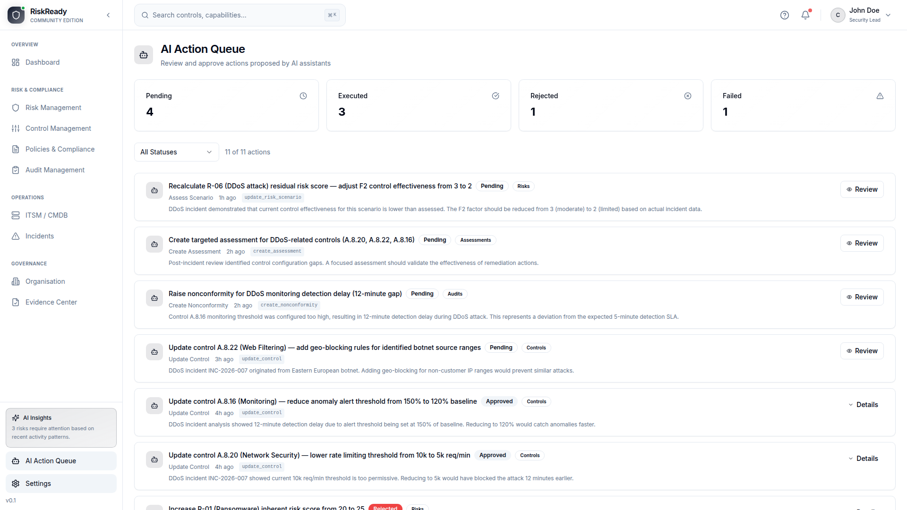

---

## GRC Features

| Module | Capabilities |
|--------|-------------|
| **Risk Management** | Risk register, risk scenarios, key risk indicators, tolerance statements, treatment plans |
| **Controls Framework** | Control library, control assessments, Statement of Applicability, gap analysis |
| **Policy Management** | Document lifecycle, version control, change requests, reviews, exceptions |
| **Incident Management** | Incident tracking, classification, response workflows, lessons learned |
| **Audit Management** | Internal audit planning, nonconformity tracking, corrective actions |
| **Evidence Management** | Evidence collection, file storage, linking to controls and risks |
| **ITSM / Asset Management** | IT asset register, change management, capacity planning, business process mapping |
| **Organisation Management** | Organisational structure, departments, locations, key personnel |

<details>
<summary><strong>Screenshots</strong> (click to expand)</summary>
<br />

**Risk Dashboard** — Heatmap, KRI status, top risks, treatment progress

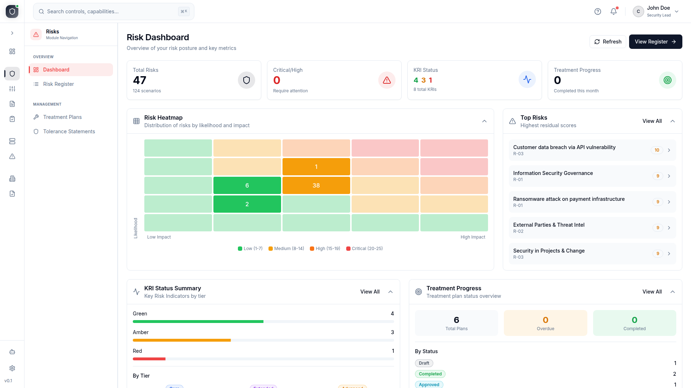

**Risk Register** — All risks with tier, status, framework mapping, and scores

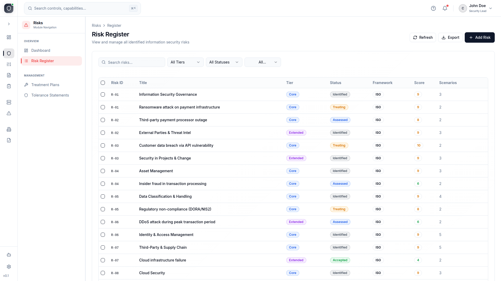

**Control Command Center** — Framework health, effectiveness metrics, compliance coverage

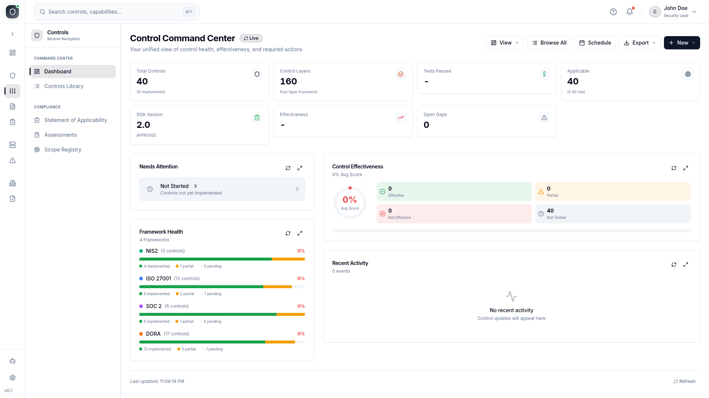

**Controls Library** — 40 controls across ISO 27001, DORA, NIS2, SOC 2

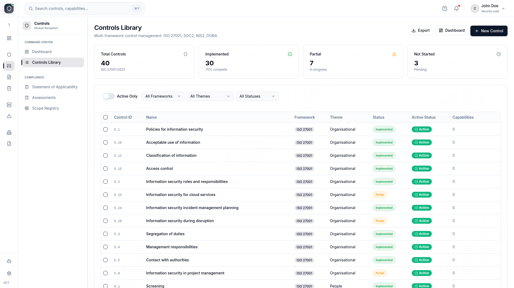

**Incident Management** — NIS2/DORA compliance tracking, response metrics, recent incidents

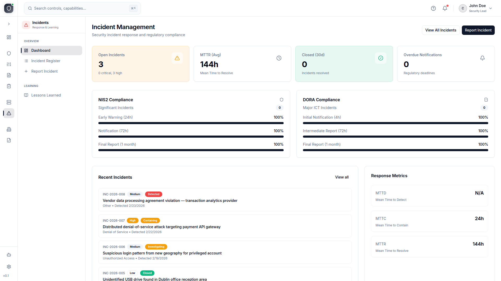

**Evidence Center** — Repository, approval rate, evidence requests, linked entities

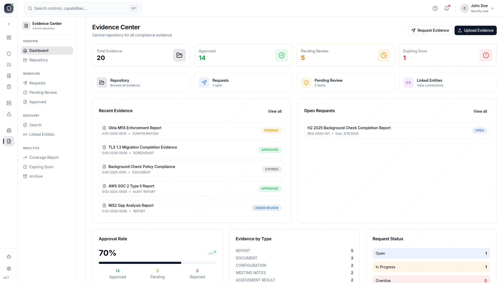

**Audit Management** — Audit workspace, nonconformity tracking, evidence requests

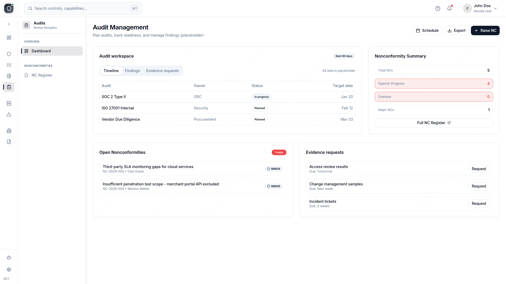

**ITSM Dashboard** — Asset register, capacity warnings, change management

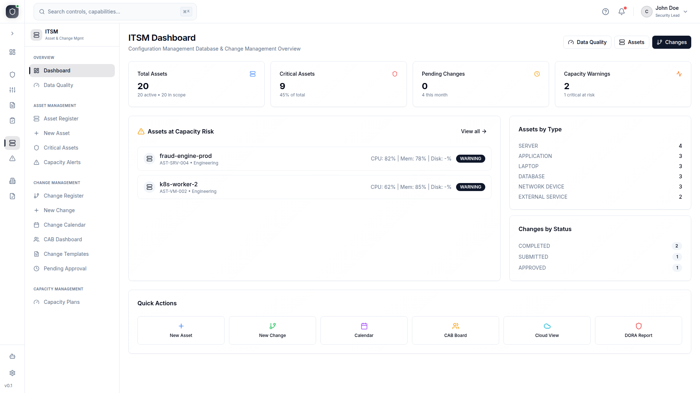

**Organisation** — Company profile, departments, global locations map

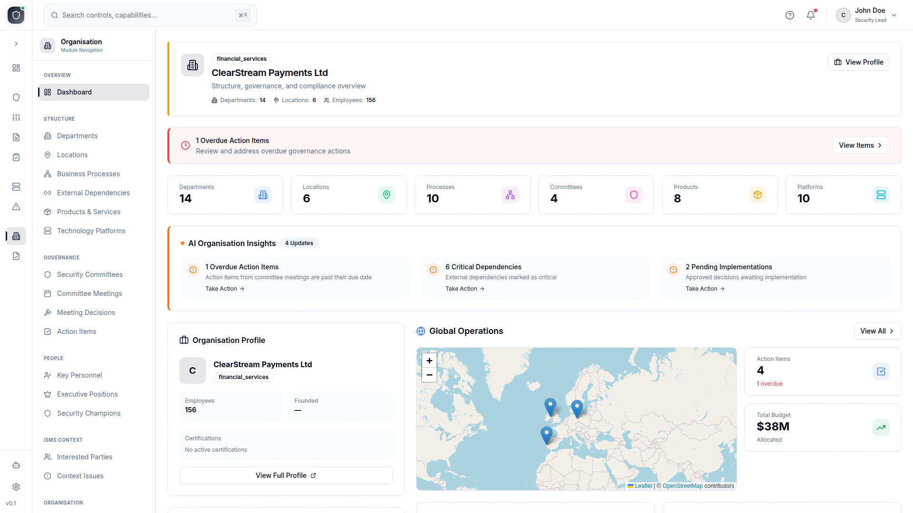

</details>

---

## Tech Stack

| Component | Technology |
|-----------|------------|
| Backend | NestJS 11 (TypeScript) |
| Frontend | React 18 + Vite + TailwindCSS |
| Database | PostgreSQL 16 |
| ORM | Prisma 5 |
| AI Gateway | Fastify + Claude Agent SDK + 9 MCP Servers + AI Agents Council |
| Reverse Proxy | Caddy 2 |

---

## Quick Start

### Prerequisites

| Resource | Minimum | Recommended |
|----------|---------|-------------|
| **RAM** | 4 GB | 8 GB |
| **CPU** | 2 cores | 4 cores |
| **Disk** | 8 GB free | 15 GB free |
| **Docker** | Docker Engine 24+ with Compose v2 | Latest stable |
| **OS** | Linux, macOS, or Windows (WSL2) | Linux |
| **Architecture** | x86_64 (amd64) or ARM64 (Apple Silicon, AWS Graviton) | — |

> **Build memory:** The first build compiles 4 Docker images in parallel and requires **4 GB RAM minimum**. On memory-constrained VMs, build sequentially to reduce peak usage:
> ```bash
> docker compose build --parallel 1
> docker compose up -d
> ```

At idle, the full stack uses **~450 MB RAM**. Under load with AI gateway active, expect up to **2.5 GB**.

### Install

```bash
# 1. Clone the repository
git clone https://github.com/riskreadyeu/riskready-community.git
cd riskready-community

# 2. Create your environment file
cp .env.example .env
# Edit .env and set: POSTGRES_PASSWORD, JWT_SECRET, ADMIN_EMAIL, ADMIN_PASSWORD

# 3. Start all services (first run takes ~3 minutes to build)
docker compose up -d

# 4. Open http://localhost:9380 and log in
```

### Demo Data (auto-populated)

On first deploy, the database is automatically populated with a realistic demo dataset for **ClearStream Payments Ltd** -- a fictional mid-size European fintech regulated under DORA and NIS2. No manual import needed.

The demo includes: 15 risks with 30 scenarios, 40 ISO 27001 controls, 12 policies, 8 incidents, 20 IT assets, 5 audit nonconformities, 20 evidence records, and 6 months of trend data across all dashboards.

**Demo login credentials:**

| Email | Role | Password |
|-------|------|----------|
| `ciso@clearstream.ie` | CISO (recommended) | `password123` |
| `ceo@clearstream.ie` | CEO | `password123` |
| `cto@clearstream.ie` | CTO | `password123` |
| `isms@clearstream.ie` | ISMS Manager | `password123` |
| `security.lead@clearstream.ie` | IT Security Lead | `password123` |
| `compliance@clearstream.ie` | Compliance Officer | `password123` |
| `risk.analyst@clearstream.ie` | Risk Analyst | `password123` |
| `dpo@clearstream.ie` | Data Protection Officer | `password123` |
| `champion@clearstream.ie` | Security Champion | `password123` |

> The CISO account provides the most complete view of all modules and dashboards.

**Admin account** (configured via `.env`):

| Field    | Value                    |
|----------|--------------------------|
| Email    | Your `ADMIN_EMAIL` value  |
| Password | Your `ADMIN_PASSWORD` value |

> Change these in your `.env` file before deploying to production.

To use AI features, connect the MCP servers to **Claude Code** or **Claude Desktop**. See the [AI Assistant Guide](documentation/AI_ASSISTANT.md) for setup instructions.

> For detailed configuration, production setup, and troubleshooting, see the [Deployment Guide](documentation/DEPLOYMENT.md).

---

## Documentation

### Deployment Guide

**[documentation/DEPLOYMENT.md](documentation/DEPLOYMENT.md)**

Everything you need to get RiskReady running: prerequisites, Docker Compose quick start, environment variable reference, port mappings, volume persistence, production configuration with TLS, AI features setup, verification steps, and troubleshooting.

### User Guide

**[documentation/USER_GUIDE.md](documentation/USER_GUIDE.md)**

Complete walkthrough of the web application for GRC practitioners, CISOs, and compliance officers. Covers all 8 modules: Risk Management, Control Management, Policy Management, Incident Management, Audit Management, Evidence Management, ITSM/Asset Management, and Organisation Management. Includes navigation, executive dashboard, settings, the AI action approval queue, and common UI patterns.

### AI Assistant Guide

**[documentation/AI_ASSISTANT.md](documentation/AI_ASSISTANT.md)**

How the AI architecture works: the 9 MCP servers and their 250+ tools, connecting Claude Code and Claude Desktop, example queries for each GRC domain, the human-in-the-loop approval queue, the AI Agents Council, scheduled workflows, anti-hallucination safeguards, and model selection.

### Agentic AI Platform Guide

**[documentation/AGENTIC_AI_PLATFORM.md](documentation/AGENTIC_AI_PLATFORM.md)**

Deep dive into the autonomous agentic AI capabilities: the approval feedback loop, persistent task tracking, scheduled and event-driven runs, cross-domain workflows, and the AI Agents Council with 6 specialist agents. Includes architecture diagrams, configuration reference, and API endpoints.

### API Reference

**[documentation/API_REFERENCE.md](documentation/API_REFERENCE.md)**

Full REST API documentation covering all endpoints grouped by module: Authentication, Dashboard, Controls, Assessments, SOA, Risks, Scenarios, Treatment Plans, Policies, Incidents, Audits, Evidence, ITSM, Organisation, Gateway Configuration, and MCP Approvals. Includes request/response formats, query parameters, and status codes.

### Administration Guide

**[documentation/ADMINISTRATION.md](documentation/ADMINISTRATION.md)**

System administration handbook: database backup and recovery, monitoring and health checks, updating and rollback procedures, user management, security hardening checklist, database management, log analysis and debugging, performance tuning, and a service architecture reference.

### MCP Server Reference

**[documentation/mcp-servers/](documentation/mcp-servers/)**

Detailed per-server documentation for all 9 MCP servers with complete tool listings, parameters, and usage examples. The servers can also be used standalone with any MCP-compatible client (Claude Desktop, Claude Code, etc.) by pointing to their `src/index.ts` entry point.

| Server | Tools | Documentation |
|--------|-------|---------------|
| Controls | 68 (30 query, 38 mutation) | [controls.md](documentation/mcp-servers/controls.md) |
| Risks | 33 (22 query, 11 mutation) | [risks.md](documentation/mcp-servers/risks.md) |
| ITSM | 40 (25 query, 15 mutation) | [itsm.md](documentation/mcp-servers/itsm.md) |
| Organisation | 32 (19 query, 13 mutation) | [organisation.md](documentation/mcp-servers/organisation.md) |
| Policies | 25 (14 query, 11 mutation) | [policies.md](documentation/mcp-servers/policies.md) |
| Incidents | 19 (11 query, 8 mutation) | [incidents.md](documentation/mcp-servers/incidents.md) |
| Evidence | 16 (10 query, 6 mutation) | [evidence.md](documentation/mcp-servers/evidence.md) |
| Audits | 15 (8 query, 7 mutation) | [audits.md](documentation/mcp-servers/audits.md) |
| Agent Ops | 7 (7 query) | [documentation/AGENTIC_AI_PLATFORM.md](documentation/AGENTIC_AI_PLATFORM.md) |

---

## Development Setup

```bash
# Start the database
docker compose up db -d

# Install dependencies
cd apps/server && npm install
cd ../web && npm install

# Configure server environment
cd ../server
cp .env.example .env
# Edit .env with your local database URL

# Set up database
npx prisma db push --schema=prisma/schema
npm run prisma:seed

# Start development servers
npm run dev          # Backend on http://localhost:4000
cd ../web && npm run dev  # Frontend on http://localhost:5173
```

---

## Business Edition

The RiskReady Business Edition includes additional modules for larger organisations:

- Risk Appetite and Tolerance Cascade
- Loss Magnitude Catalogue (FAIR methodology)
- Supply Chain Risk Management
- Business Continuity Management (BCM/BIA)
- Vulnerability Management
- Application Security Posture
- External Requirements Mapping (ISO 27001, DORA, NIS2)

Contact us for more information about the Business Edition.

---

## Contributing

See [CONTRIBUTING.md](CONTRIBUTING.md) for development setup, code style guidelines, and pull request process.

## Security

See [SECURITY.md](SECURITY.md) for our responsible disclosure policy.

## License

This project is licensed under the [GNU Affero General Public License v3.0](LICENSE).
